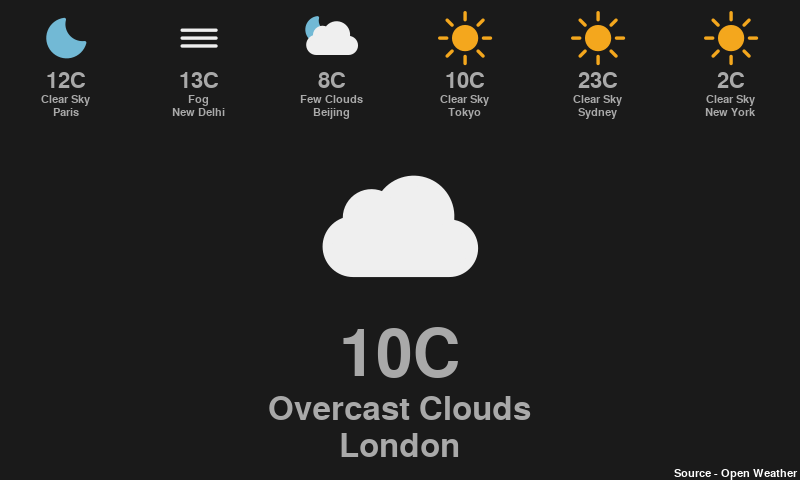

# Displays the current weather

Written in Python using Pygame. 

Displays  the weather in the selected locations around the world using  the
Open  Weather  API  and can be run in a window or on the  console  in  full 
screen mode if you are using the 7 inch Raspberry Pi screen.



To use the script you will need to obtain you own Open Weather API key from
the [Open Weather site](https://home.openweathermap.org/users/sign_up), and
then run the script from the command line or a 'bash' script specifying the
AppID and the locatons to display.

```
./py-pygame-weather-display.py --appid '<API_Key>' 'London' 'Paris' ...
```

Works with Python 3.x only.

## Dependencies
* python3-tz
* python3-pygame
* python3-cairosvg 
